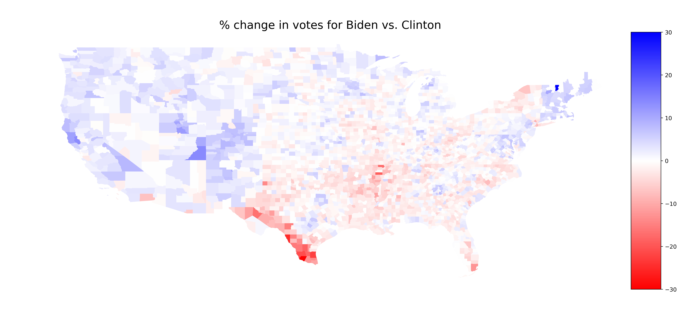

#2020 Election Trends
Hillary Clinton's loss to Donald Trump in the 2016 election was one of the biggest political upsets in American history. Trump flipping the pro-Obama Rust Belt states of Pennsylvania, Ohio, Michigan, and Wisconsin in his favor made the difference. Likewise, Joe Biden reclaiming these states for the Democratic Party, save for Ohio, has led him to victory in 2020. This raises the question: what votes did Biden win that Clinton didn't? To start, let's look at the differences in how each county voted in the past two elections.

  

